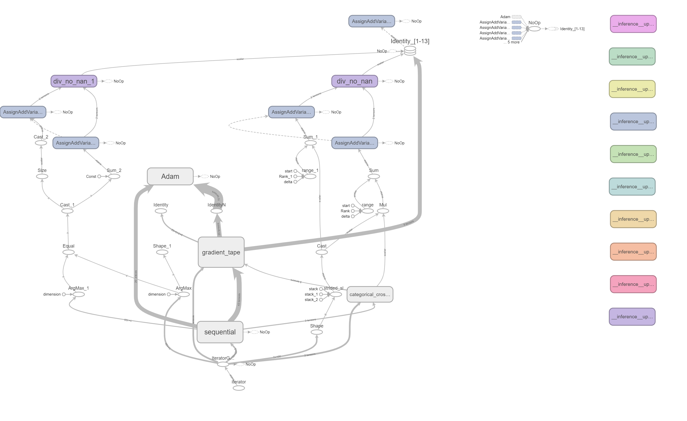
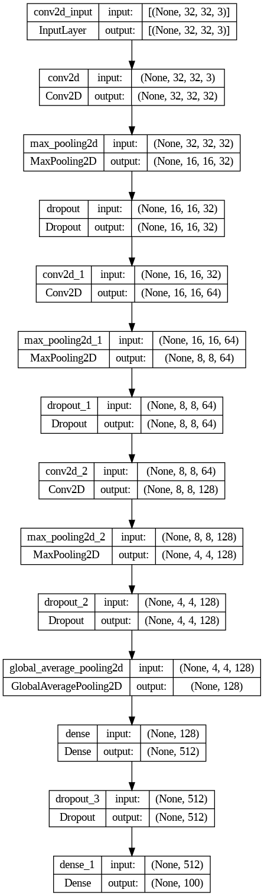
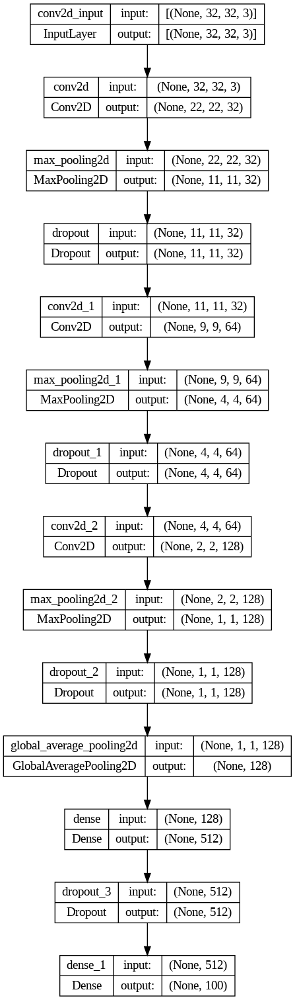
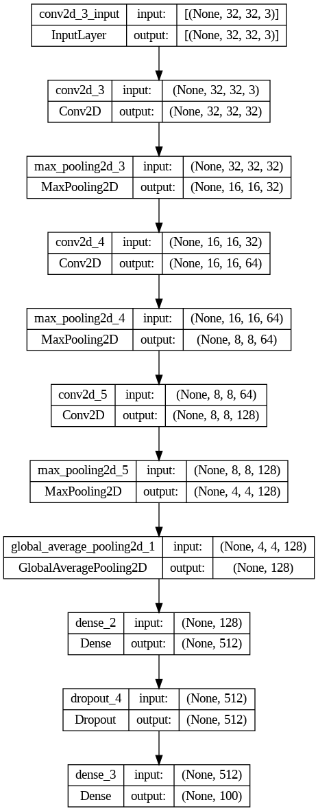
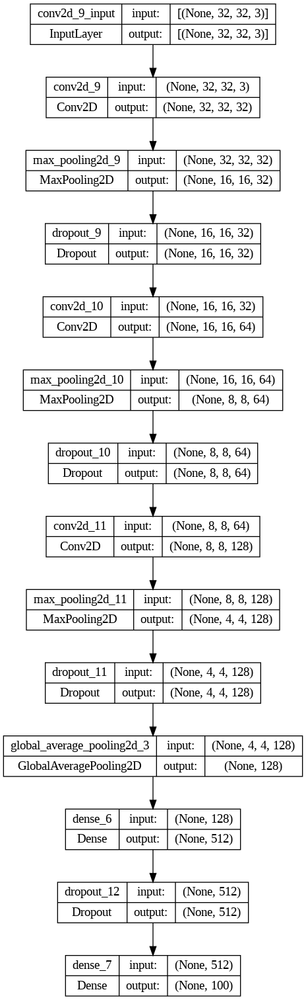
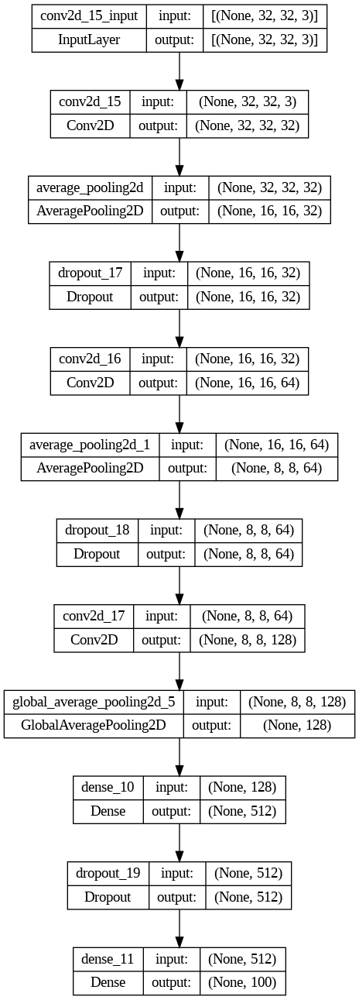

# Deep-Learning

### MODEL ARCHITECTURE

## Original Model

## Kernel_padding_lr Changed Model

## Removed All DropoutLayer

## Optimizer from Adam to RMSprop

##  Optimizer from Adam to RMSprop

## Eliminated certain Layers and Dropout Layers.

